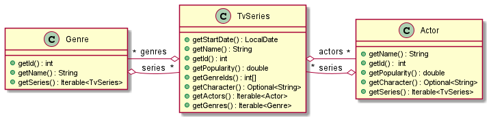

# Enunciado do Trabalho II - parte I

**Data limite de entrega: 23 de Maio**

**Objectivos**: Prática com funções de primeira classe, expressões lambda,
funções de ordem superior, `Iterable<T>`

**NOTA**: 
1.  A solução entregue deve incluir todos os testes unitários necessários para
    validar o correcto funcionamento das funcionalidades pedidas. 
    **ATENÇÃO**: os testes devem verificar o correcto funcionamento do projeto mesmo sem
    ligação à internet.
2.  Este trabalho deve ser desenvolvido usando como base o projecto Gradle
    **moviesdb** disponibilizado em https://github.com/isel-leic-mpd/moviesdb.
    Copie toda a solução incluindo o ficheiro `.gitignore` para o repositório
    Github do grupo de MPD.
3.  Cada trabalho será desenvolvido num novo módulo dentro do projecto
    `moviesdb`. Neste Trabalho 1 apenas trabalhará no módulo 
    `moviesdb-lazy`.

Implemente a biblioteca `moviesdb-lazy` que disponibiliza informação detalhada
sobre séries de Tv, os seus géneros e os seus actores. 
Os dados são obtidos a partir de uma API RESTful:
https://developers.themoviedb.org/3/getting-started/introduction.
O modelo de domínio (serviço) é formado pelas entidades: `TvSeries`, `Genre` e `Actor` e obedece à
especificação apresentada no diagrama de classes seguinte:

 

As classes do modelo de domínio estão implementadas no módulo **moviesdb-lazy**.
Todas as relações entre as entidades de domínio são mantidas de forma **lazy**.

A instanciação e navegação dos objectos de domínio é feita por
`MoviesDbService` que recorre à classe `MoviesDbWebApi` para realizar os pedidos à
Web Api de Movies Database.
 
 

## 1. **util** `LazyQueries`

O módulo **moviesdb-lazy**  recorre a **boardstar-util** para executar tarefas
auxiliares tais como operações sobre sequências implementadas pela classe
`LazyQueries`.
Implemente em `LazyQueries` as seguintes operações e **todos os testes unitários
necessários à validação dos respectivos métodos**:

1. Baseando-se nas implementações dadas nas aulas, acrescente os métodos:
   * _factory_: `Iterable<T> iterate(T seed, UnaryOperator<T> acc)`;
   * operações intermédias:   `skip()`, `limit()`, `map()`,`flatMap` e `takeWhile;
   * operações terminais: `count()` , `Object[] toArray()`,`first()` e `max()`.
 
3. `last(Iterable<T> src)` - retorna o último elemento da sequência `src` na forma de `Optional<T>`
4. `skipWhile(Iterable<T> src, Predicate<T> pred)` - retorna uma nova sequência que descarta da sequência original os primeiros
    elementos que satisfazem o predicado
 


## 2. **moviesdb-lazy** `MoviesDbWebApi`

Implemente os métodos de `MoviesDbWebApi` e **todos os testes unitários
necessários à validação dos respectivos métodos**.

**Note que todos os testes devem validar corretamente o projecto mesmo
na ausência de ligação  à internet.**

Para implementar as funcionalidade de `BgaWebApi` deve recorrer às seguintes rotas da Web API de Board Game Atlas:
  * https://api.themoviedb.org/3/genre/tv
  * https://api.themoviedb.org/3/discover/tv
  * https://api.themoviedb.org/3/tv
  * https://api.themoviedb.org/3/person

Os resultados da API RESTFul podem ser convertidos através da biblioteca Gson
para instâncias de classes pré-definidas (DTOs).


## 3. **moviesdb-lazy** `MoviesDbService`

Implemente os métodos de ` MoviesDbService ` e **todos os testes unitários
necessários à validação dos seus métodos**.

As relações entre as entidades do modelo de domínio (`Genre`, `TvSeries` e `Actor`)
devem ser mantidas de forma **lazy**.
Os testes unitários devem validar o comportamento lazy, verificando que não são realizadas
operações de IO (e.g. HTTP ou acesso a ficheiros) enquanto não é obtido o `Iterator` resultante.
Por exemplo, a chamada a `getGenres()` não deve desencadear acesso de IO, tal como a chamada 
a `getTvSeries()` sobre uma instância de `Genre` também não deve fazer acesso IO até que os objectos 
`Iterator` sejam obtidos.

Note que alguns dos métodos de `MoviesDbWebApi` recebem um segundo parâmetro
inteiro correspondente ao número da página.
Nestes casos o método correspondente de `MoviesDbService` deve retornar um iterável
que percorre os elementos de todas as páginas disponíveis até ser obtida uma
página sem elementos ou o número máximo de elementos requisitados ter sido atingido.
Para tal deve executar um encadeamento de operações semelhante ao seguinte:

```
range(…) ==> 1,2,3,.., maxPage 
           ==> map(invoke MoviesDbWebApi) 
           ==> list 1, list 2, … 
           ==> takeWhile(list.size() != 0) 
           ==> flatMap(lst) 
           ==> map(dto -> model)
```

